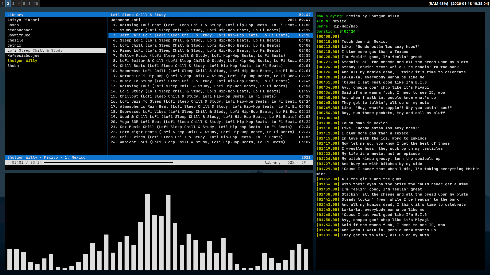

# lyriccli
CLI for fetching lyrics for various providers

currently works for [cmus player](https://cmus.github.io/)



## How to run


clone the git repository
```
git clone https://github.com/KrishnaSSH/lyriccli
```

make a virutal environment
```
python -m venv venv
```

activate the virtual environment
```
source venv/bin/activate
```

install the dependencies
```
pip install -r requirements.txt
```

run
```
python main.py
```
